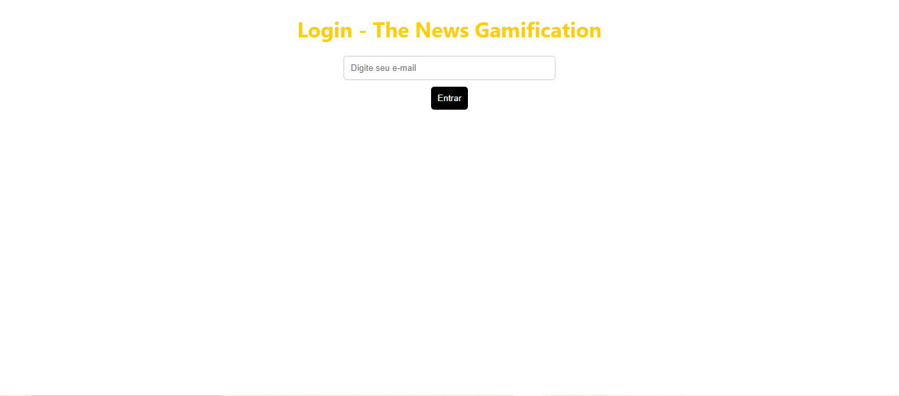
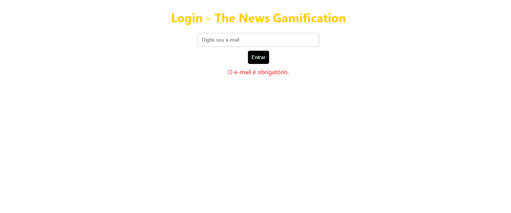
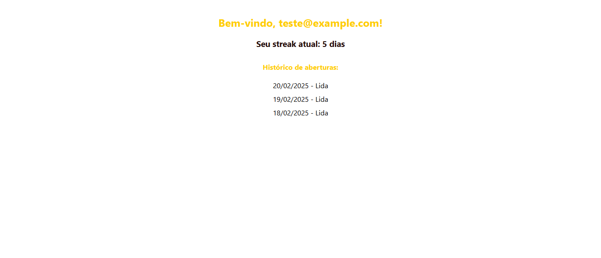
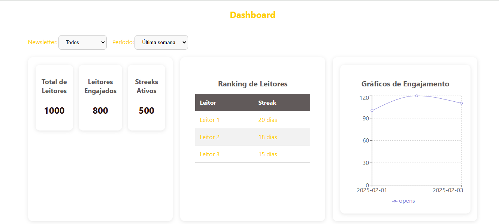

# Front end Engajamento de Leitores

Este é um projeto para visualização de métricas de engajamento de leitores de newsletters. Ele permite que os administradores monitorem dados de usuários, streaks de leitura, e métricas de engajamento, enquanto os leitores podem acompanhar o seu progresso e manter seu streak de leitura.

## Funcionalidades

### **Área de Login para Leitores**

- **Página de Login**: Onde os leitores podem se autenticar usando seu **e-mail**.
- **Exibição de Streak**: Mostra quantos dias consecutivos o leitor abriu a newsletter.
- **Histórico de Aberturas**: Exibe o histórico de aberturas do leitor.

### **Dashboard Administrativo**

- **Visão Geral das Métricas**: Exibe métricas como o total de leitores, leitores engajados e streaks ativos.
- **Ranking de Leitores**: Exibe uma lista com os leitores mais engajados, junto com seu streak atual.
- **Filtros**: Permite filtrar os dados por **newsletter**, **período de tempo** (última semana, último mês) e **status do streak**.
- **Gráficos de Engajamento**: Mostra gráficos com dados sobre o engajamento dos leitores.

### Atenção

- Dados Mocados

## Como Usar

### Requisitos

- Node.js (versão >= 14.x)
- npm (ou yarn)

#### Passos para rodar o projeto

- Clone do repositório : git clone https://github.com/suellykarine/gameficacao-front
- Instale as dependencias: npm install
- Inicie o servidor: npm start: O projeto ficará acessível na URL http://localhost:3000 (ou na porta configurada no seu projeto).

## Modelos das telas

### **Área de Login para Leitores**

### **Validação de Login para Leitores**

### **Streak de Leitura**

### **Dashboard Administrativos**

